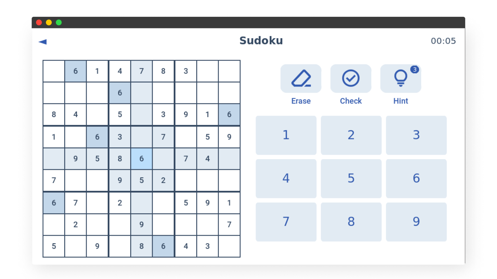

<div align="center">

# Pydoku

**A Sudoku game using Python Tkinter with puzzle generation and solver**



</div>

## About

Pydoku is a Sudoku game built in Python using
[Tkinter](https://docs.python.org/3/library/tkinter.html). It generates random
puzzles, lets users solve them, and offers hints. It also includes a solver that
uses backtracking to find solutions. The interface is designed to be minimal and
easy to use.

### Features

- **User Interface**
  - **Board**: display 9x9 grids with clear sub-grid separation.
  - **Highlights**: highlight the selected cell, its row, column, and sub-grid.
  - **Timer**: display a timer while solving.
- **User Input**
  - **Cell selection**: click on a cell to select it.
  - **Number input**: enter numbers using on-screen buttons or the keyboard.
  - **Erase input**: use an erase button to clear a cell.
- **Validation**
  - **Manual check**: a “check” button validates the entire board.
  - **Game completion**: the game ends automatically when the puzzle is solved
    correctly.
- **Levels**
  - **Difficulty selection**: choose from: Quickie, Easy, Medium, Hard, Expert.
- **Solver**
  - **Hints**: reveal a correct number in a selected cell.
- **Help**
  - **How to play**: instructions for selecting cells, inputting numbers, using
    tools, etc.

## Installation

1. Clone the repository:
   ```sh
   git clone https://github.com/andrianllmm/pydoku.git
   cd pydoku
   ```
2. Create and activate virtual environment:
   ```sh
   python -m venv venv
   source venv/bin/activate  # or venv\Scripts\activate for Windows
   ```
3. Install the dependencies
   ```sh
   pip install -r requirements.txt
   ```
4. Run the app
   ```sh
   cd src/app.py
   ```

## Contributing

Contributions are welcome! To get started:

1. Fork the project
2. Create your feature branch (`git checkout -b feature/AmazingFeature`)
3. Commit your changes (`git commit -m 'Add some AmazingFeature'`)
4. Push to the branch (`git push origin feature/AmazingFeature`)
5. Open a pull request

## Issues

Found a bug or issue? Report it on the
[issues page](https://github.com/andrianllmm/pydoku/issues).
