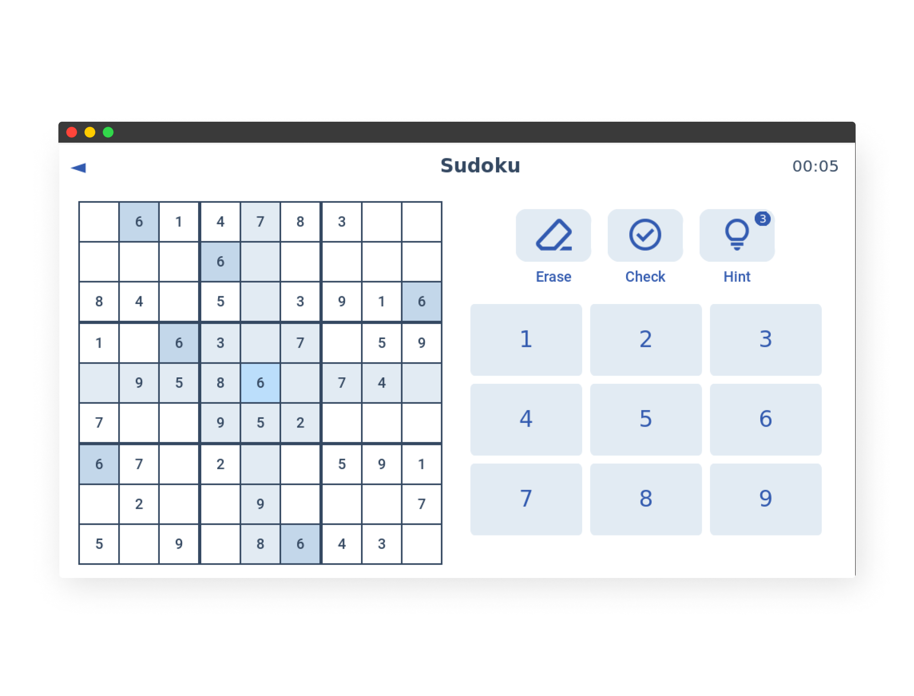

# Pydoku

A Python-based Sudoku game using **Tkinter** with puzzle generation, solver, and validation.

<p align="center">
   
</p>


## Features

- **User Interface**
   - **Board**: Display 9x9 grids with clear sub-grid separation.
   - **Highlights**: Highlight the selected cell, its row, column, and sub-grid.
   - **Timer**: Display a timer while solving.

- **User Input**
   - **Cell Selection**: Click on a cell to select it.
   - **Number Input**: Enter numbers using on-screen buttons or the keyboard.
   - **Erase Input**: Use an erase button to clear a cell.

- **Validation**
   - **Manual Check**: A “check” button validates the entire board.
   - **Game Completion**: The game ends automatically when the puzzle is solved correctly.

- **Levels**
   - **Difficulty Selection**: Choose from: Quickie, Easy, Medium, Hard, Expert.

- **Solver**
   - **Hints**: Reveal a correct number in a selected cell.

- **Help**
   - **How to Play**: Instructions for selecting cells, inputting numbers, using tools, etc.


## Installation

1. Clone the repository:
   ```bash
   git clone https://github.com/andrianllmm/pydoku.git
   cd pydoku
   ```

2. Create and activate virtual environment:
   ```bash
   python -m venv venv

   # Linux/macOS:
   source venv/bin/activate
   # Windows:
   .\venv\Scripts\activate
   ```

3. Install dependencies:
   ```bash
   pip install -r requirements.txt
   ```

4. Run the app:
   ```bash
   cd src/app.py
   ```